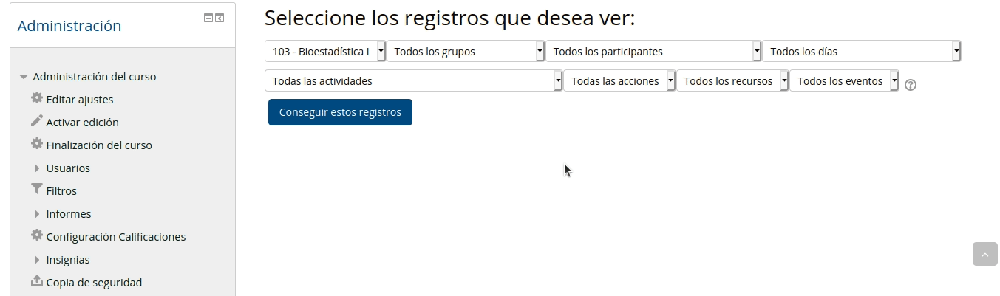

# Moodle-R

Codigos para Generar reportes de actividad estudiantil con los registros de Moodle + R

* [Presentación en LatinR2020](https://www.youtube.com/watch?v=NuwV6MOvCBY&list=PL9-E3cL2KgKlkjEb7wFN_lAeO72sLFY3D&index=3)

* [Acceso al código de los graficos](https://github.com/NAlcan/Moodle---R/blob/main/RegistrosDiariosMoodle.R)

* [Publicación: El índice de actividad individual de los estudiantes en EVA y sus rendimientos académicos: el caso de Bioestadística Veterinaria](https://ojs.intercambios.cse.udelar.edu.uy/index.php/ic/article/view/259)

# ¿Cómo descargar los registros en Moodle?

### Dentro del curso y con el "Modo edición" activado:

1. Ir a panel de Administración:
 + Informes
  + Registros (manteniendo todas las opciones por defecto Salvo la ultima)
   + "Todos lo eventos  = Participando" (para descartar registros de los docentes)

2. Conseguir estros registros

3. Descargar datos de tabla como  ".csv" (recomendado)

